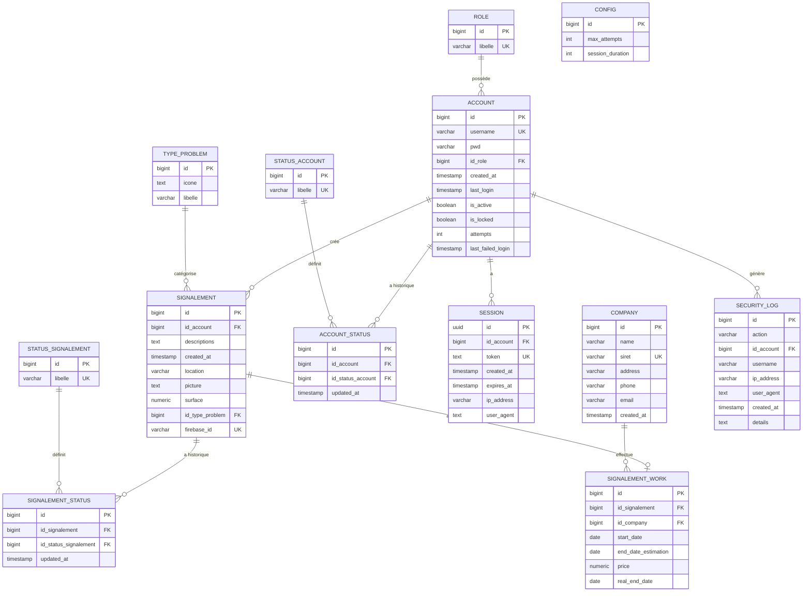

# Modèle Conceptuel de Données (MCD)
## Roadworks Tracker - Suivi des travaux routiers

## Légende des relations

| Relation | Description |
|----------|-------------|
| ROLE → ACCOUNT | Un rôle peut avoir plusieurs comptes (1:N) |
| ACCOUNT → SESSION | Un compte peut avoir plusieurs sessions actives (1:N) |
| ACCOUNT → SIGNALEMENT | Un compte peut créer plusieurs signalements (1:N) |
| SIGNALEMENT → SIGNALEMENT_STATUS | Un signalement a un historique de statuts (1:N) |
| SIGNALEMENT → SIGNALEMENT_WORK | Un signalement peut avoir des travaux associés (1:0..1) |
| COMPANY → SIGNALEMENT_WORK | Une entreprise peut effectuer plusieurs travaux (1:N) |

## Valeurs par défaut

### Rôles
- manager
- utilisateur
- visiteur

### Statuts de compte
- actif
- inactif
- suspendu

### Statuts de signalement
- nouveau
- en_cours
- resolu
- rejete

### Types de problèmes
- Nid de poule ⚠️
- Glissement de terrain 🚨
- Inondation 💧
- Effondrement de route 💥
- Travaux routiers 🚧
- Obstacle sur la route 🚷
- Marquage usé ❌
- Danger général ⚠️
